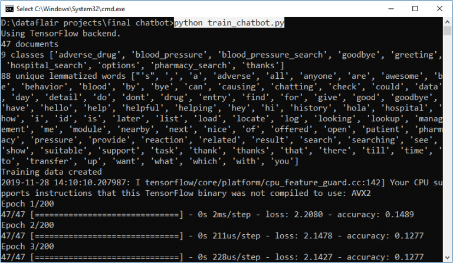
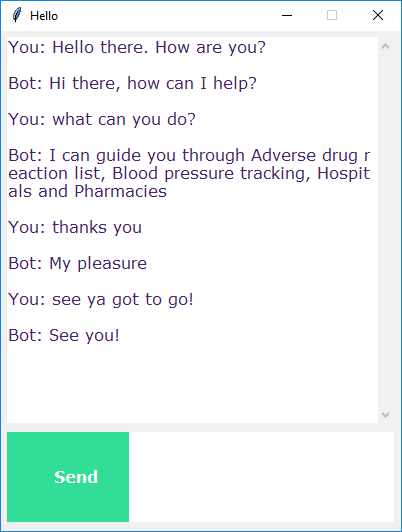

# Chatbot

A chatbot is an intelligent piece of software that is capable of communicating and performing actions similar to a human.

In this Python project, i tried to build a chatbot using deep learning techniques. The chatbot will be trained on the dataset which contains categories (intents), pattern and responses. We use a special recurrent neural network (LSTM) to classify which category the user’s message belongs to and then we will give a random response from the list of responses.

Let’s create a retrieval based chatbot using NLTK, Keras, Python, etc.

requirements: pip install tensorflow, keras, pickle, nltk

OUTPUT:

